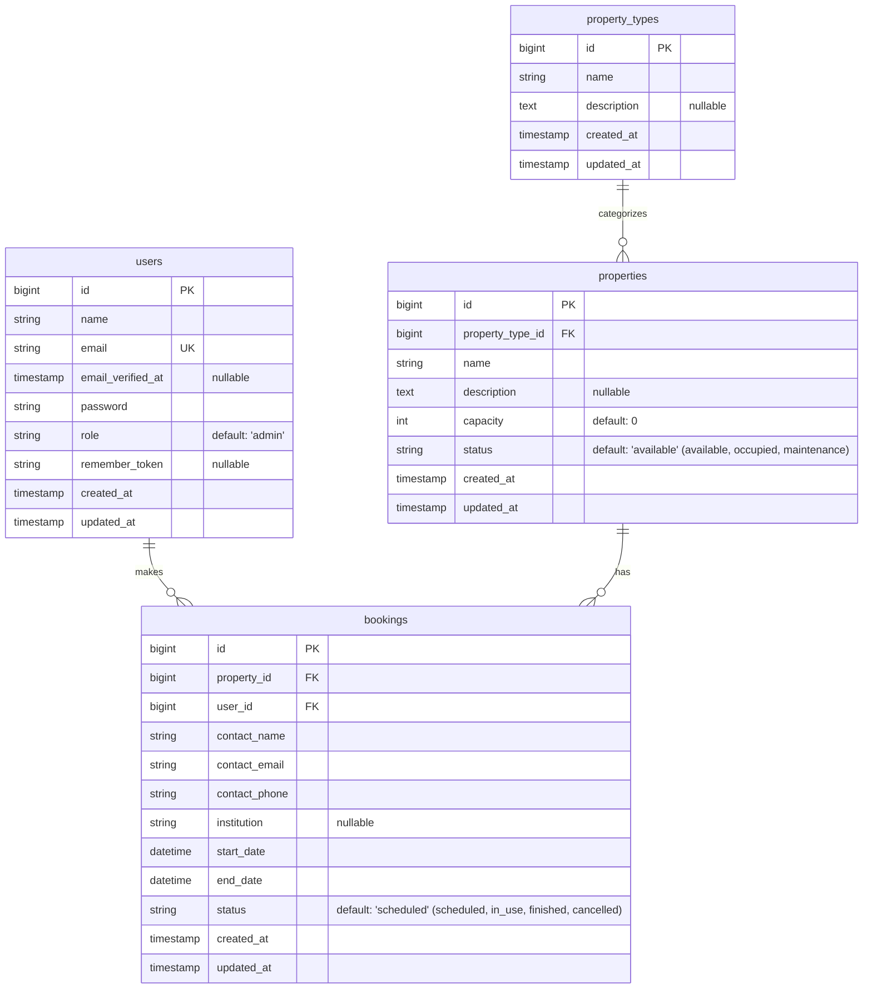

# BDIRoom Project Summary & Database Documentation

## 1. Project Overview
BDIRoom is a Meeting Room & Property Booking System built with a scalable backend architecture. It allows administrators to manage different types of properties (e.g., meeting rooms, bedrooms), handle bookings, and track the status of these properties. The system incorporates rule-based availability management where property statuses adjust dynamically based on active booking periods.

### Key Technologies
- **Backend Framework:** Laravel (PHP)
- **Database:** Relational Database (accessed via Eloquent ORM)
- **Authentication:** Laravel Sanctum (Token-based authentication)

## 2. Core System Features

### Authentication & Authorization
- **Admin Access:** Login is restricted strictly to users with the `admin` role (SRS 3.1 check).
- **Token Management:** Leverages Laravel Sanctum to issue Bearer tokens upon successful authentication and revoke them upon logout.

### Property Management
- **Property Types:** Organizes properties into categories with customizable names and descriptions.
- **Properties:** Individual bookable units (such as meeting rooms) linked to a specific property type. Attributes include capacity, detailed descriptions, and a status tracking indicator (`available`, `occupied`, `maintenance`).
- **Dynamic Status Tracking (SRS 3.5):** Property statuses automatically shift from `available` to `occupied` dynamically when fetching a property if there's an ongoing, currently active booking associated with that property.

### Booking System
- **Comprehensive Booking Records:** Each booking tracks contact details (name, email, phone), affiliated institution, and the precise start and end dates/times of usage.
- **Status Lifecycle:** Bookings support varied states, capturing the lifecycle flow: `scheduled`, `in_use`, `finished`, and `cancelled`.

---

## 3. Entity Relationship Diagram (ERD)

The following Mermaid diagram visualizes the database schema and entity relationships representing the core domain of the platform.

---

## 4. Entity Attribute Dictionary

Below is the detailed schema dictionary for the core tables defining the backend structure.

### `users`
| Column | Data Type | Modifiers / Constraints | Description |
| :--- | :--- | :--- | :--- |
| **id** | `bigint` | Primary Key, Auto Increment | Unique identifier for the user. |
| **name** | `string` | Not Null | The user's full name. |
| **email** | `string` | Unique, Not Null | The user's email address (used for login). |
| **email_verified_at**| `timestamp` | Nullable | Records when the user verified their email. |
| **password** | `string` | Not Null | Hashed password. |
| **role** | `string` | Default: `admin` | Application access level (Admin-only restriction enforced). |
| **remember_token** | `string(100)`| Nullable | Token for "remember me" functionality. |
| **created_at** | `timestamp` | Nullable | Record creation timestamp. |
| **updated_at** | `timestamp` | Nullable | Record last-update timestamp. |

### `property_types`
| Column | Data Type | Modifiers / Constraints | Description |
| :--- | :--- | :--- | :--- |
| **id** | `bigint` | Primary Key, Auto Increment | Unique identifier. |
| **name** | `string` | Not Null | Name of the type (e.g., "Meeting Room"). |
| **description** | `text` | Nullable | Detailed breakdown of what the type encompasses. |
| **created_at** | `timestamp` | Nullable | Record creation timestamp. |
| **updated_at** | `timestamp` | Nullable | Record last-update timestamp. |

### `properties`
| Column | Data Type | Modifiers / Constraints | Description |
| :--- | :--- | :--- | :--- |
| **id** | `bigint` | Primary Key, Auto Increment | Unique identifier for the room/property. |
| **property_type_id** | `bigint` | Foreign Key, Not Null, Cascade Delete | Links to the `property_types` table. |
| **name** | `string` | Not Null | Display name for the specific property. |
| **description** | `text` | Nullable | Extensive details, specs, or amenities description. |
| **capacity** | `integer` | Default: 0 | Maximum number of people the room holds. |
| **status** | `string` | Default: `available` | Manual override state (`available`, `occupied`, `maintenance`). Overridden dynamically to `occupied` if an active booking is ongoing. |
| **created_at** | `timestamp` | Nullable | Record creation timestamp. |
| **updated_at** | `timestamp` | Nullable | Record last-update timestamp. |

### `bookings`
| Column | Data Type | Modifiers / Constraints | Description |
| :--- | :--- | :--- | :--- |
| **id** | `bigint` | Primary Key, Auto Increment | Unique identifier for the booking event. |
| **property_id** | `bigint` | Foreign Key, Not Null, Cascade Delete | Links strictly to the `properties` table. |
| **user_id** | `bigint` | Foreign Key, Not Null, Cascade Delete | Links to the `users` table indicating who booked/registered it. |
| **contact_name** | `string` | Not Null | The primary guest or point of contact. |
| **contact_email** | `string` | Not Null | The point of contact's email address. |
| **contact_phone** | `string` | Not Null | Phone number for the booking contact. |
| **institution** | `string` | Nullable | External company or institution name the contact represents. |
| **start_date** | `datetime` | Not Null | Formal scheduling start limit. |
| **end_date** | `datetime` | Not Null | Formal scheduling end limit. |
| **status** | `string` | Default: `scheduled` | Allowed states: `scheduled`, `in_use`, `finished`, `cancelled`. |
| **created_at** | `timestamp` | Nullable | Record creation timestamp. |
| **updated_at** | `timestamp` | Nullable | Record last-update timestamp. |

---

## 5. API Reference Summary

All functional endpoints reside under the `/api` prefix and (with the exception of `/login`) require standard Bearer token header authorization (`Authorization: Bearer {token}`).

- **Authentication**
  - `POST /login` - Issues a Sanctum token on successful validation.
  - `POST /logout` - Revokes validation.

- **Admin/Property Types** (`apiResource`)
  - `GET /property-types`
  - `POST /property-types`
  - `GET /property-types/{id}`
  - `PUT/PATCH /property-types/{id}`
  - `DELETE /property-types/{id}`

- **Admin/Properties** (`apiResource`)
  - `GET /properties` (Includes dynamic capacity mapping)
  - `POST /properties`
  - `GET /properties/{id}`
  - `PUT/PATCH /properties/{id}`
  - `DELETE /properties/{id}`

- **Admin/Bookings** (`apiResource`)
  - `GET /bookings`
  - `POST /bookings`
  - `GET /bookings/{id}`
  - `PUT/PATCH /bookings/{id}`
  - `DELETE /bookings/{id}`
