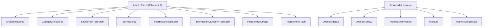
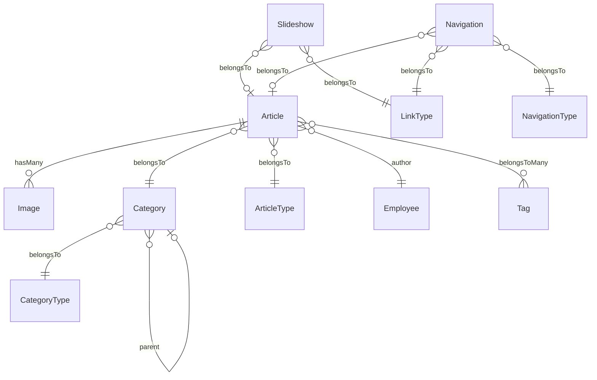

# Analisis CMS BDIYK Baru

> **Framework:** Laravel 12 + Filament 3 + Livewire 3  
> **Multi-bahasa:** Spatie Translatable (id/en)

---

## Arsitektur CMS

---

## 1. Artikel

### Model: `Article`

| Field | Tipe | Keterangan |
|-------|------|------------|
| `category_id` | FK | Relasi ke Category |
| `article_type_id` | FK | Tipe: News, Gallery, Page, Information |
| `author_id` | FK | Relasi ke Employee (penulis) |
| `image` | string | Gambar utama (storage) |
| `title` | JSON | Multi-bahasa (id/en) |
| `summary` | JSON | Ringkasan multi-bahasa |
| `content` | JSON | Konten multi-bahasa (rich text) |
| `hit` | int | Penghitung kunjungan |
| `is_active` | bool | Status aktif/draft |
| `published_at` | datetime | Jadwal publish |
| `sort` | int | Urutan (untuk tipe Information) |
| `year` | int | Tahun |
| `files` | JSON | File lampiran |
| `original_files` | JSON | Nama file asli |

**Relasi:**
- `belongsTo` → Category, ArticleType, Employee (author)
- `belongsToMany` → Tag (pivot `article_tag`)
- `hasMany` → Image (galeri)

**Fitur:**
- Auto-slug dari judul + ID (`judul-artikel-123`)
- Scope `published()` — filter artikel aktif & sudah terbit
- Auto-sort pada tipe Information saat create
- Hapus gambar dari storage saat artikel dihapus

### Tipe Artikel (`ArticleType`)

| Enum Value | Slug | Penggunaan |
|------------|------|------------|
| News | `news` | Berita |
| Gallery | `gallery` | Galeri foto |
| Page | `page` | Halaman statis |
| Information | `information` | Informasi publik |

### Admin: `ArticleResource`
- CRUD lengkap dengan rich text editor
- Upload gambar & file lampiran
- Pilih kategori, tag, tipe artikel
- Jadwal publish, toggle aktif/draft
- Translatable (id/en)

### Frontend Routes
| Route | Component | Keterangan |
|-------|-----------|------------|
| `/{article_type}` | `Articles\Index` | Listing (news/gallery/page) |
| `/{article_type}/{slug}` | `Articles\Show` | Detail artikel |
| `/information` | `Articles\Information` | Halaman informasi |

---

## 2. Kategori

### Model: `Category`

| Field | Tipe | Keterangan |
|-------|------|------------|
| `name` | JSON | Nama multi-bahasa |
| `parent_id` | FK (self) | Kategori induk (hierarkis) |
| `category_type_id` | FK | Tipe: Article / Information |
| `sort` | int | Urutan |
| `is_root` | bool | Kategori default |
| `is_active` | bool | Status aktif |

**Relasi:**
- `hasMany` → Article, children (self-referencing)
- `belongsTo` → parent (self), CategoryType

**Fitur:**
- Hierarkis (parent-child)
- Auto-sort saat create
- Saat hapus: artikel dipindah ke kategori root, sort di-adjust

### Admin: `CategoryResource`, `InformationCategoryResource`

---

## 3. Tag

### Model: `Tag`

- Nama multi-bahasa (translatable)
- Relasi many-to-many ke Article via pivot `article_tag`

### Admin: `TagResource`

---

## 4. Galeri Gambar (Image)

### Model: `Image`

| Field | Tipe | Keterangan |
|-------|------|------------|
| `article_id` | FK | Relasi ke Article |
| `path` | string | Path file gambar |
| `caption` | string | Keterangan gambar |

- Digunakan khusus untuk tipe artikel **Gallery**

---

## 5. Slideshow / Banner

### Model: `Slideshow`

| Field | Tipe | Keterangan |
|-------|------|------------|
| `link_type_id` | FK | Tipe link (Article/Internal/External/Empty) |
| `article_id` | FK | Link ke artikel (opsional) |
| `image` | string | Gambar banner |
| `title` | JSON | Judul multi-bahasa |
| `description` | JSON | Deskripsi multi-bahasa |
| `path` | string | URL link |
| `target_blank` | bool | Buka di tab baru |
| `is_active` | bool | Status aktif |
| `sort` | int | Urutan (auto-increment) |

**Fitur:**
- Link dinamis: bisa ke artikel, URL internal, URL eksternal, atau tanpa link
- Auto-sort, hapus gambar saat delete

### Admin: `SlideshowResource`

---

## 6. Navigasi (Menu)

### Model: `Navigation`

| Field | Tipe | Keterangan |
|-------|------|------------|
| `navigation_type_id` | FK | Header atau Footer |
| `link_type_id` | FK | Article/Internal/External/Empty |
| `article_id` | FK | Link ke artikel (opsional) |
| `name` | JSON | Label multi-bahasa |
| `path` | string | URL |
| `target_blank` | bool | Buka di tab baru |
| `is_active` | bool | Status aktif |

**Fitur:**
- **Nested Set** (tree structure) — menu bertingkat tanpa batas level
- Scope per `navigation_type_id` (header vs footer terpisah)
- Link dinamis sama seperti Slideshow

### Admin: `HeaderMenuPage`, `FooterMenuPage`
- Drag & drop tree untuk atur hierarki dan urutan menu

---

## 7. REST API Konten (v1)

| Endpoint | Method | Deskripsi |
|----------|--------|-----------|
| `/api/v1/articles` | GET | List artikel |
| `/api/v1/articles/{id}` | GET | Detail artikel by ID |
| `/api/v1/articles/slug/{slug}` | GET | Detail artikel by slug |
| `/api/v1/categories` | GET | List kategori |
| `/api/v1/categories/{id}` | GET | Detail kategori |
| `/api/v1/slideshows` | GET | List slideshow aktif |

---

## Diagram Relasi

---

## Ringkasan Fitur CMS

| Fitur | Status |
|-------|--------|
| Multi-bahasa (id/en) | ✅ |
| Rich text editor | ✅ |
| Upload gambar & file | ✅ |
| Jadwal publish | ✅ |
| Hit counter | ✅ |
| Kategori hierarkis | ✅ |
| Tag system | ✅ |
| Slideshow/banner | ✅ |
| Menu dinamis (tree) | ✅ |
| REST API untuk konten | ✅ |
| SEO-friendly slug | ✅ |
